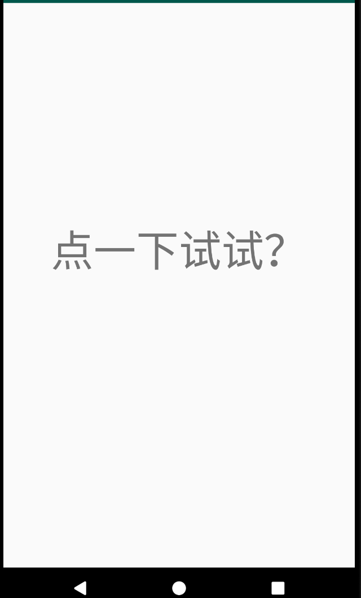
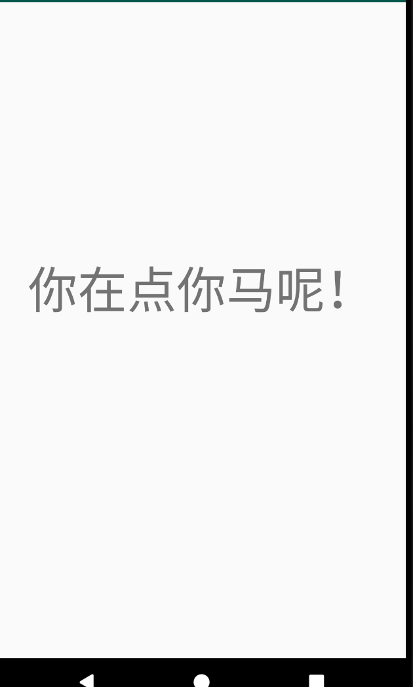
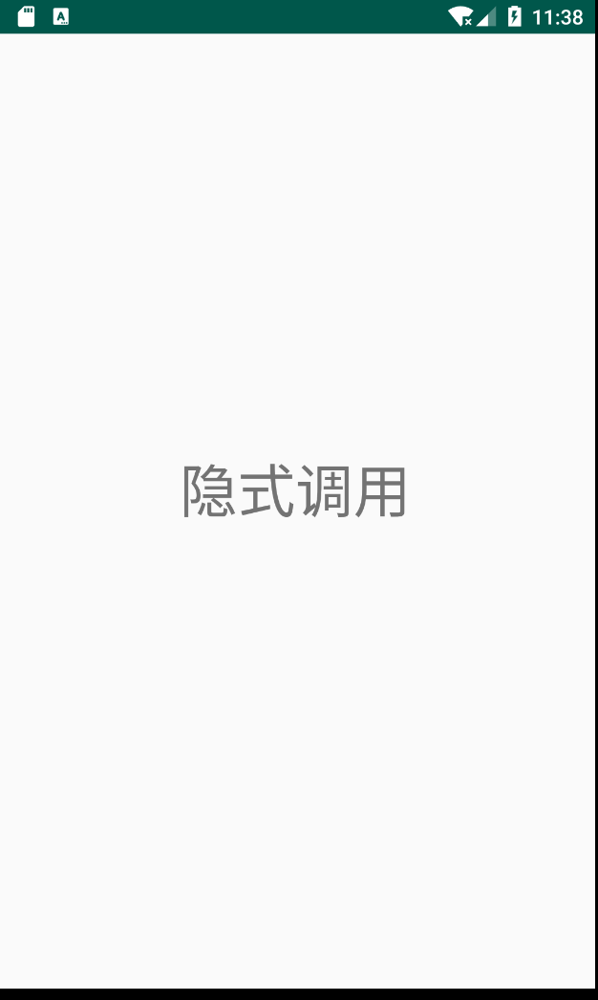

# AndroidStudioProjects

*Android Studio Projects power by Java*

### First

[Hello World](https://github.com/EslSuwen/AndroidStudioProjects/tree/master/HelloWorld)

完成 TextView 显示及点击事件改变文字。

### Second

[SecondSet](https://github.com/EslSuwen/AndroidStudioProjects/tree/master/Second)
第二次集合
<imag src="Second/SecondSet/2_1.png" width="100">

#### 1. 多种 intent 方式实现

[IntentApplication](https://github.com/EslSuwen/AndroidStudioProjects/tree/master/Second/IntentApplication)

#### 2.简单拨号，短信，照相机调用，地图打开的功能 

[SimpleApp](https://github.com/EslSuwen/AndroidStudioProjects/tree/master/Second/SimpleApp)

#### 3.测试启动其他activity，横竖屏变化时的生命周期

[TestCC](https://github.com/EslSuwen/AndroidStudioProjects/tree/master/Second/TestCC)

#### 4.添加显示学生信息包括姓名、专业

[StudentINFO](https://github.com/EslSuwen/AndroidStudioProjects/tree/master/Second/StudentINFO)

