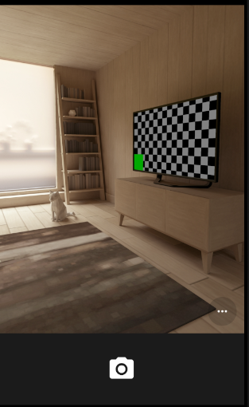
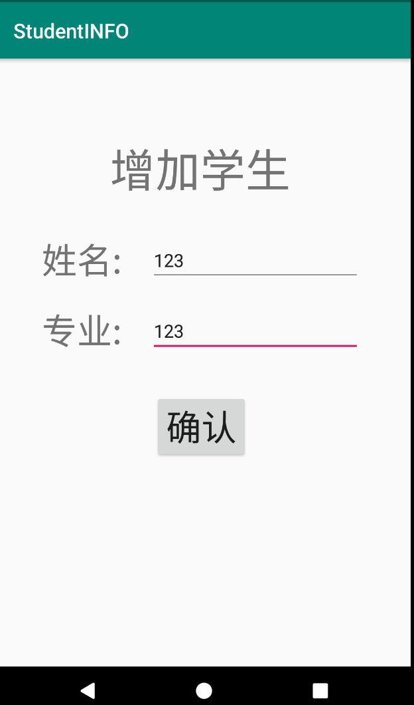

# AndroidStudioProjects

*Android Studio Projects power by Java*

> 记录 android 学习。

### First

#### 1.[Hello World](./First/HelloWorld)

完成 TextView 显示及点击事件改变文字。

#### 2.[BasicCamera]()

简单相机，完成简单的照相并显示功能。

#### 3.[DateTest]()

日期显示，日期控件获取日期并自定义格式显示。

### Second

#### 1.[IntentApplication](./Second/IntentApplication)

多种 intent 方式实现

#### 2.[SimpleApp](./Second/SimpleApp)

简单拨号，短信，照相机调用，地图打开的功能 

#### 3.[TestCC](./Second/TestCC)

测试启动其他activity，横竖屏变化时的生命周期

#### 4.[StudentINFO](./StudentINFO)

添加显示学生信息包括姓名、专业

### Third

#### 1.[学生管理](./Third/ListViewApp)

1. 实现多个学生信息的添加和显示
2. 用EditText实现姓名、年龄的输入，并有输入校验（空校验，数字校验）
3. 用AutoCompleteTextView的实现专业的输入，并有提示功能。
4. 通过CheckBox实现多门课程选择
5. 通过Radio实现性别
6. 用下拉框选择学院
7. 用日期控件实现入学时间的输入
8. 点击提交按钮后，将输入的信息，用列表控件ListView显示在另一个Activity。
9. 实现列表中学生信息的编辑和删除。

#### 2.[seekBar](./Third/Work6)

seekBar实现图片的缩放、旋转。

#### 3.[图形切换控件](./Third/Work7s)

下载多张图片，在图形切换控件中轮流显示，并有慢进慢出的动画效果。

### Fourth

#### 1.[登录页面](./Fourth/SimpleLogin)

一个登录页面，能记住账号和密码的功能

#### 2.[本地照相机]()

调用照相机，将拍照图片存储在SD卡中，并通过一个Listview列表进行管理。

#### 3.[SQLite学生信息管理系统](./Fourth/StudentDemo)

通过一个SQLite的数据库的操作实现学生信息的增删改查。

#### 4.[2048小游戏](./Fourth/Game2048)

#### 5.[音乐播放器](./Fourth/MyMusicDemo)

